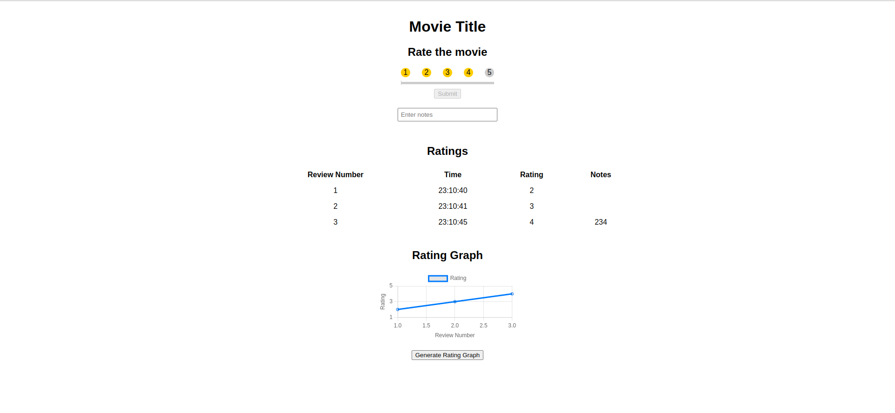

# LiveStar

A new concept of rating films. You get prompted throughout the film's duration to give a star rating at that given point. At the end the average of those ratings are displayed as the overall rating. The prompts for the ratings will be able to be programmed based on time intervals or significant events in said film. 

## Image

## Table of Contents

- Installation
- Usage
- Contributing
- License

## Installation

Clone the repository
> git clone https://github.com/dbq0pdb/LiveStar

Cd to project 
> cd LiveStar

## Usage

Start the Html page

> Right click `index.html` and select `open with` and select browser of your choice

## Contributing

N/A

## License

N/A
